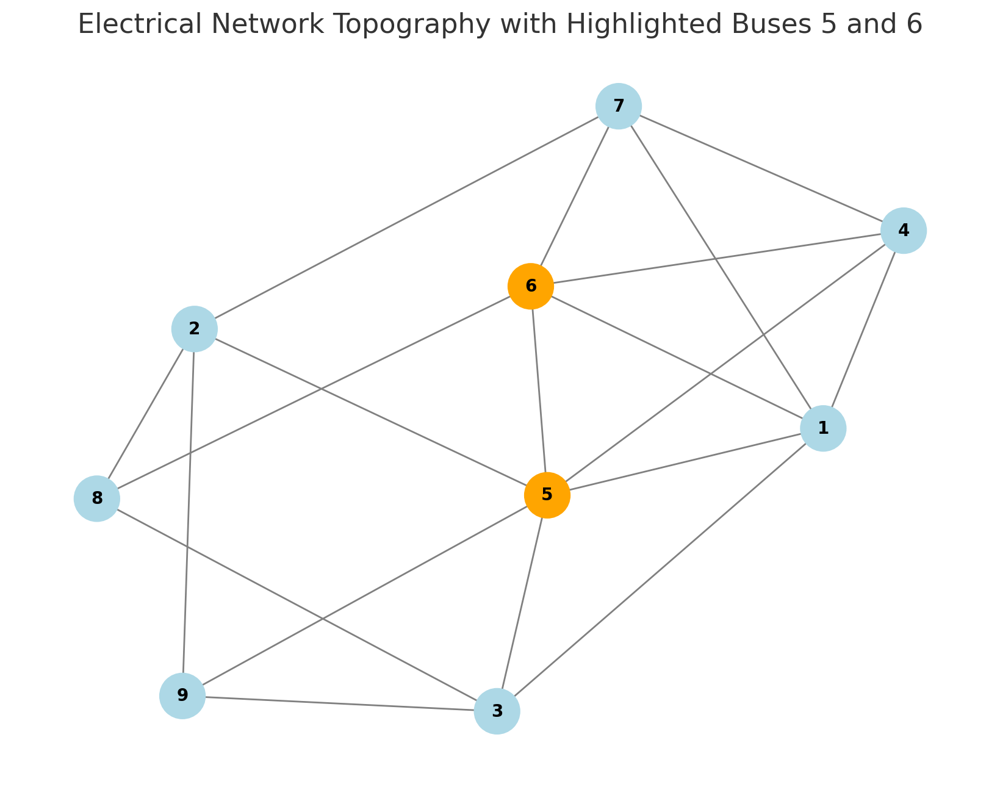

# Energy Investment Analysis Platform

## Overview
This project analyzes different energy system scenarios using DC Optimal Power Flow (DCOPF) to evaluate various combinations of generation sources including nuclear, solar, wind, and storage systems. The analysis considers technical feasibility, economic efficiency, and system reliability across different seasonal patterns.

### Base Network Structure
The analysis is built around a base grid topology with two main load buses. This fundamental structure serves as the foundation for all scenario analyses:

{width=500}

*The base network defines the core infrastructure upon which different generation scenarios are evaluated.*

### Scenario Analysis
Each scenario represents a unique combination of:
- Generation asset placement at specific buses
- Storage unit allocation
- Load scaling factors
- Seasonal variations (winter, summer, autumn/spring)

This modular approach allows us to evaluate various investment strategies while maintaining the core network constraints.

## Results

### Global Analysis
- [Global Comparison Report](data/results/global_comparison_report.md)


### Individual Scenario Reports
${scenario_links}

## Project Structure
```
├── data/
│   ├── working/          # Input data files
│   └── results/          # Generated results and analysis
├── scripts/
│   ├── core/            # Core processing modules
│   ├── visualization/   # Plotting and visualization
│   └── utils/          # Helper utilities
└── figures/             # Generated figures and diagrams
```

## Key Features
- DCOPF analysis for multiple scenarios
- Seasonal analysis (winter, summer, autumn/spring)
- Generation vs demand visualization
- AI-powered scenario critique
- Economic and technical feasibility assessment
- Modular scenario creation around base network topology
- Investment optimization for different time horizons

## Running the Analysis
1. Ensure all dependencies are installed:
```bash
pip install -r requirements.txt
```

2. Set up your OpenAI API key in `.env.local`:
```
OPENAPI_KEY=your_api_key_here
```

3. Run the main analysis:
```bash
python scripts/multi_scenario.py
```

## Visualization Examples
Each scenario analysis includes:
- Generation vs Demand plots for each season
- Generation mix analysis
- Capacity factor comparisons
- Economic metrics
- AI-generated critiques
- Network topology visualizations

## Contributing
Feel free to open issues or submit pull requests with improvements.

## License
[MIT License](LICENSE)
