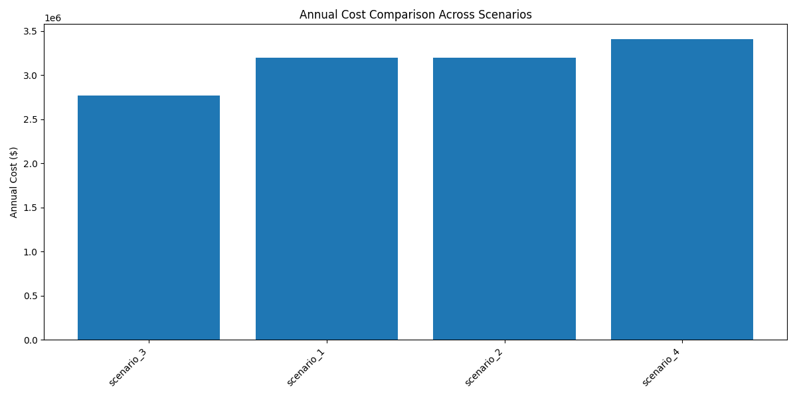

# Global Scenarios Comparison Report
Generated on: 2025-02-15 12:05

## Investment Analysis

```
Scenario       Initial Inv.        Annual Cost         10y NPV             20y NPV             30y NPV             Annuity             
-----------------------------------------------------------------------------------------------------------------------------
7              CHF 2'750'000       CHF 942'766         CHF -9'918'474      CHF -13'556'583     CHF -15'233'659     CHF 1'353'167       
3              CHF 2'550'000       CHF 980'376         CHF -9'821'150      CHF -13'571'752     CHF -15'258'653     CHF 1'355'387       
6              CHF 2'300'000       CHF 1'048'043       CHF -9'829'002      CHF -13'616'754     CHF -15'353'770     CHF 1'363'836       
5              CHF 3'000'000       CHF 905'287         CHF -10'113'189     CHF -13'807'976     CHF -15'478'398     CHF 1'374'906       
9              CHF 3'200'000       CHF 1'048'043       CHF -10'849'783     CHF -14'693'481     CHF -16'578'091     CHF 1'472'589       
1              CHF 900'000         CHF 1'380'923       CHF -10'286'888     CHF -14'634'833     CHF -16'770'455     CHF 1'489'676       
10             CHF 4'100'000       CHF 887'122         CHF -11'361'773     CHF -15'060'448     CHF -16'896'633     CHF 1'500'885       
2              CHF 1'400'000       CHF 1'300'109       CHF -10'637'014     CHF -15'080'109     CHF -17'193'991     CHF 1'527'298       
8              CHF 1'800'000       CHF 1'275'673       CHF -11'172'440     CHF -15'548'394     CHF -17'715'738     CHF 1'573'644       
4              CHF 2'100'000       CHF 1'482'721       CHF -12'967'033     CHF -18'400'575     CHF -20'754'695     CHF 1'843'586       
```

## Annual Cost Comparison



# Comparative Analysis of Energy Scenarios

## Overall Trends in Cost Effectiveness
The analysis of operational costs and NPV over a 30-year horizon reveals significant disparities among the scenarios. Scenarios with a higher initial investment, such as scenario_10 (4.1M) and scenario_9 (3.2M), display notably lower NPVs (-16.9M and -16.6M, respectively), indicating less cost-effectiveness over time. Conversely, scenario_1, with the lowest initial investment (0.9M) but higher annual costs (1.38M), shows a relatively better NPV (-16.77M).

## Trade-offs Between Different Generation Mixes
The mix of generation technologies appears to influence both operational costs and NPVs. Scenarios that incorporate more renewable sources, such as wind and solar (e.g., scenarios_3, _5, and _4), tend to have higher annual costs due to operational and maintenance complexity, leading to worse NPVs. In contrast, scenarios focusing predominantly on nuclear (scenarios_1 and _2) yield lower annual operational costs while maintaining stable outputs, underscoring nuclear's role in providing a reliable energy source.

Scenarios with battery storage (2, 4, 10) experience diverse impacts on annual costs, highlighting the nuanced role of storage technology in enhancing flexibility but also introducing additional costs. Nonetheless, the cumulative effect of investment and maintenance still hinders their NPV outcomes.

## Key Success Factors in Better Performing Scenarios
Scenarios such as scenario_7 and scenario_3, which leverage nuclear power heavily while also incorporating renewable resources, demonstrate a balance of lower initial costs and manageable annual expenses, resulting in comparatively better NPVs. The optimal combination of reliable baseload generation (nuclear) and variable resources (solar and wind) alongside efficient storage solutions is essential for improving economic feasibility.

## Recommendations for Future Scenario Design
1. **Incorporation of Storage**: Future scenarios should evaluate various types of battery storage, optimizing their deployment to align with peak loads and variable renewable generation without overly inflating costs.
2. **Focus on Cost Management**: A careful balance must be struck between renewables and conventional sources, emphasizing the importance of minimizing operational costs while ensuring generation stability.
3. **Investment in Technology**: Continued investment in advanced nuclear technology and innovative renewable systems can enhance long-term cost-effectiveness.
4. **Consider Economic Incentives**: Examining government policies and market structures could yield strategies for improving project profitability and reducing perceived risks in renewable-heavy scenarios.

By emphasizing these considerations, future energy system designs can optimize economic efficiency while ensuring technical feasibility in diverse operational environments.