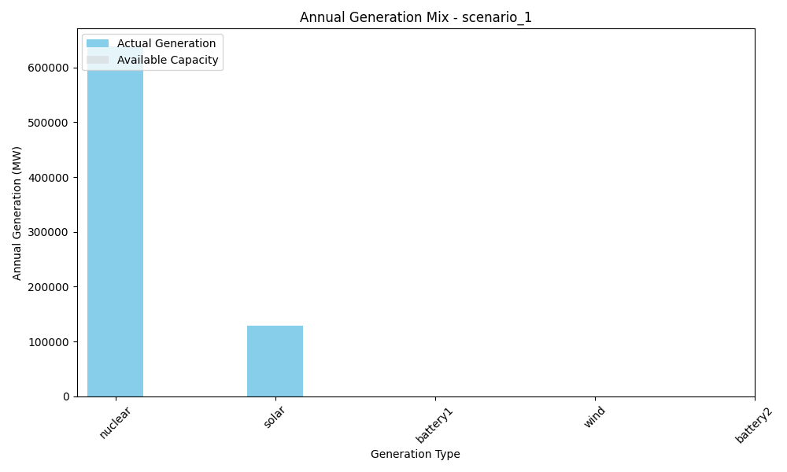
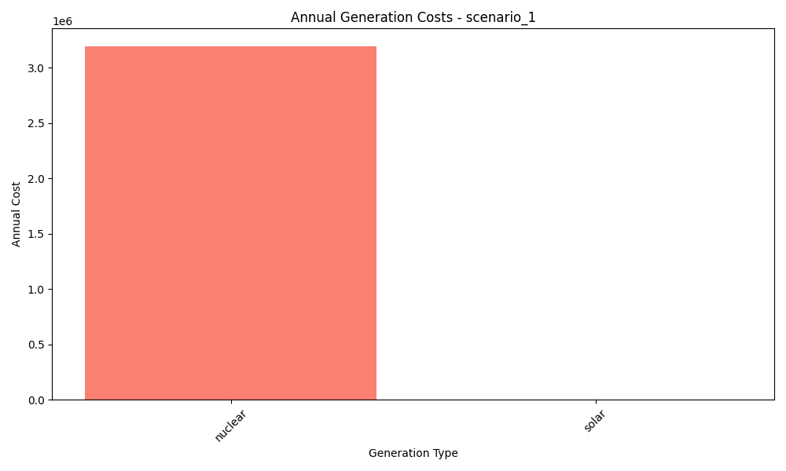
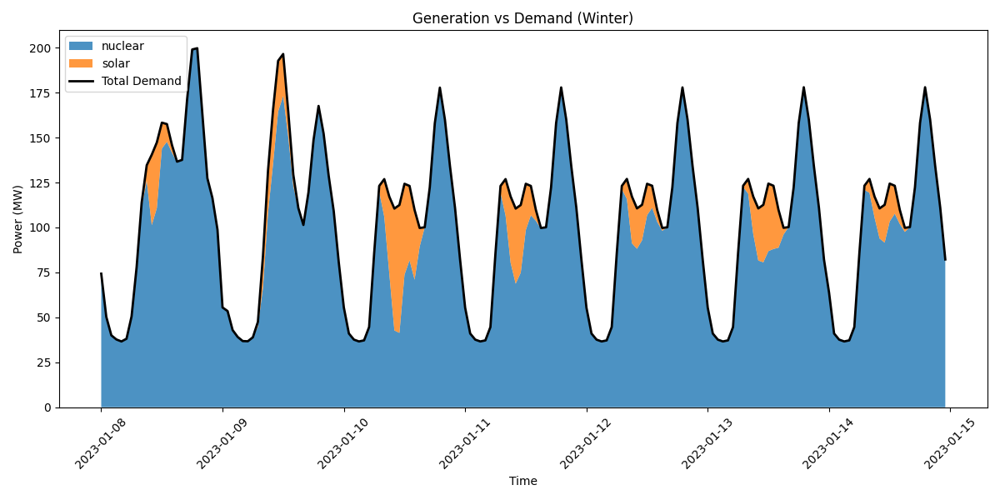

# Scenario Analysis Report: scenario_1
Generated on: 2024-12-30 01:27

## Investment Analysis
- Net Present Value (NPV): 10,460,775.66
- Annuity: 1,222,127.66
- Initial Investment: 22,290,920.00
- Annual Operating Cost: 3,195,547.30

## Annual Generation Overview


## Annual Cost Overview


## Seasonal Generation Patterns


## Generation Statistics

### Generation per Asset
```
nuclear: 639109.5
solar: 128315.6
cost_nuclear: 3195547.3
cost_solar: 0.0
battery1: nan
cost_battery1: nan
wind: nan
cost_wind: nan
battery2: nan
cost_battery2: nan
```

### Generation Costs per Asset
```
cost_nuclear: 3195547.3
cost_solar: 0.0
cost_battery1: nan
cost_wind: nan
cost_battery2: nan
```

### Capacity Factors
```
nuclear: 0.0
solar: 0.0
battery1: nan
wind: nan
battery2: nan
```

## AI Critical Analysis
## Critical Analysis of Scenario 1

### Economic Efficiency of the Generation Mix
The annual operational cost for Scenario 1 is $3,195,547.30, wholly attributed to nuclear generation, which produced 639,109.5 MW. However, the absence of operational costs associated with solar and other technologies indicates a significant over-reliance on nuclear capacity, raising questions about the overall economic efficiency of this generation mix. The zero costs associated with solar and the missing values for battery and wind systems suggest untapped potential and possibly underutilized assets.

### System Composition Strengths/Weaknesses
Strengths of this scenario include a substantial nuclear output, which is reliable and stable. However, weaknesses are prominent: the absence of generation and capacity factors for solar, wind, and battery systems implies a lack of diversity and redundancy in the energy mix, which may compromise resilience. Furthermore, the total reliance on nuclear introduces risks such as regulatory changes, decommissioning costs, and vulnerability to long-term outages.

### Key Recommendations for Improvement
1. **Diversify Generation Sources**: Integrate solar, wind, and battery storage systems to enhance resilience and capitalize on cleaner technologies. 
2. **Conduct Feasibility Studies**: Evaluate the economic viability of solar and wind, focusing on their operational cost benefits.
3. **Optimize Capacity Factors**: Investigate year-round operational strategies to improve capacity factors across all technologies, particularly for renewables.

---
