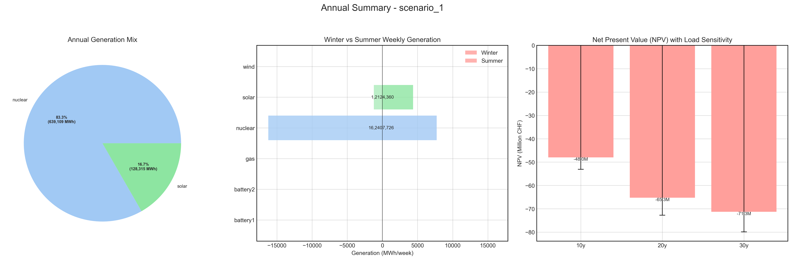
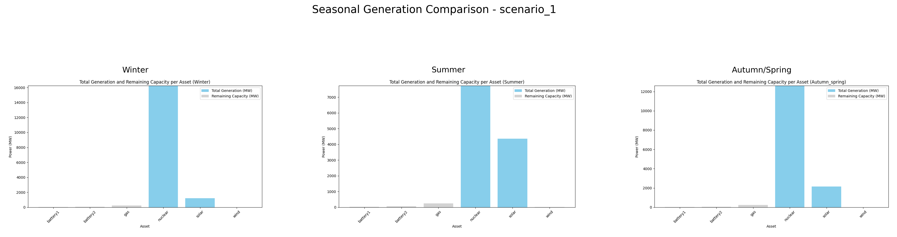

# Scenario Analysis Report: scenario_1
Generated on: 2025-01-03 19:04:55

## Overview

## Seasonal Generation Patterns

## Financial Analysis
| Metric | Value |
|--------|--------|
| Initial Investment | €22,290,920.00 |
| Annual Operating Cost | €3,195,547.30 |
| NPV (10 years) | €-47,966,145.31 |
| NPV (20 years) | €-65,258,716.13 |
| NPV (30 years) | €-71,279,828.76 |

## Generation Analysis

### Annual Generation by Asset Type
| Asset Type | Generation (MWh) |
|------------|-----------------|
| nuclear | 639,109.50 |
| solar | 128,315.60 |

### Generation Costs
| Asset Type | Cost (€) |
|------------|----------|
| nuclear | 3,195,547.30 |

### Capacity Factors
| Asset Type | Capacity Factor |
|------------|----------------|

## AI Critical Analysis
# Scenario Analysis Results - Critical Analysis

### Economic Efficiency of the Generation Mix
The economic efficiency of Scenario 1 is compromised by the reported operational costs of **$3,195,547.3** with a substantial portion attributed to nuclear generation. However, the generation costs for solar are **$0.0**, suggesting a possible asset underutilization or reporting discrepancy. The lack of data for gas and wind adds uncertainty regarding their contribution to both generation and costs.

### System Composition Strengths/Weaknesses
The presence of nuclear power offers a reliable baseload generation; however, the reported **0.0 capacity factor** indicates operational inefficiencies or downtime. Solar generation, while cost-effective, also shows a **0.0 capacity factor**, raising concerns over deployment or output issues. The absence of data for wind, gas, and batteries shows a lack of diversification, making the system vulnerable to outages and price volatility.

### Key Recommendations for Improvement
1. **Data Transparency**: Address gaps in data collection for gas, wind, and battery systems to evaluate their potential contributions fully.
2. **Diversification**: Incorporate a balanced mix of generation assets, focusing on renewable sources (wind and solar) and additional storage options to enhance resilience.
3. **Operational Optimization**: Investigate and mitigate the reasons behind low capacity factors for nuclear and solar to improve overall efficiency and reduce costs.

---
