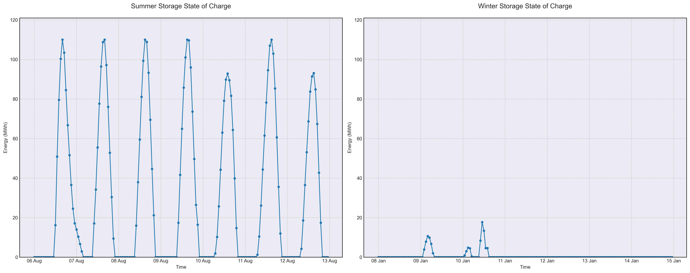

# Scenario Analysis Report: scenario_10
Generated on: 2025-02-15 10:50:56

## Overview

## Financial Analysis
| Metric | Value |
|--------|--------|
| Initial Investment | CHF 36,672,740 |
| Annual Operating Cost | CHF 887,122 |
| NPV (10 years) | CHF -68,722,565 |
| NPV (20 years) | CHF -87,939,567 |
| NPV (30 years) | CHF -95,929,620 |

## Generation Analysis

### Annual Generation by Asset Type
| Asset Type | Generation (MWh) |
|------------|-----------------|
| nuclear | 177'418 |
| solar | 125'137 |
| wind | 80'813 |
| battery2 | -327 |

### Generation Costs
| Asset Type | Cost (CHF) |
|------------|------------|
| cost_nuclear | 887'089 |

## Storage State of Charge

## AI Critical Analysis
## Critical Analysis of Scenario 10 Nominal

### Economic Efficiency
The annual operational cost of \$887,121.67 juxtaposed with the generation output highlights potential inefficiencies in the current energy mix. Notably, significant proportions of nuclear and wind resources yield high costs and an unusual wind capacity factor of 1.176, indicating either over-performance or miscalculated generation metrics. Conversely, solar generation costs appear to be effectively zero, suggesting either an absence of generation or underutilization of potential output.

### System Composition Strengths/Weaknesses
Strengths include the reliance on nuclear power, which, despite its high costs, contributes a substantial majority of generation. Weaknesses are pronounced in the solar and gas sectors, which show minimal output and zero costs, indicating underperformance. The negative capacity factor of battery2 raises concerns about reliability and energy storage effectiveness in the overall system.

### Recommendations for Improvement
- **Enhance Solar Integration**: Explore optimized deployment strategies for solar to capitalize on its potential.
- **Invest in Battery Technology**: Address the performance limitations of battery storage systems to improve flexibility and reliability during peak demands.
- **Evaluate Wind Forecasting**: Reassess wind generation metrics to ensure accurate capacity factors and reliable forecasting.
- **Cost Analysis for Gas**: Further investigation into gas costs can elucidate the role of traditional fuels in the mix, enabling informed decisions for future investments.

---
