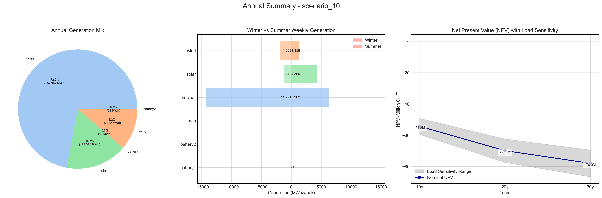
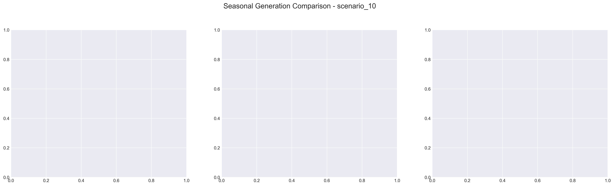

# Scenario Analysis Report: scenario_10
Generated on: 2025-01-29 17:36:30

## Overview

## Seasonal Generation Patterns

## Financial Analysis
| Metric | Value |
|--------|--------|
| Initial Investment | €22,290,920.00 |
| Annual Operating Cost | €2,764,811.86 |
| NPV (10 years) | €-54,330,481.32 |
| NPV (20 years) | €-69,884,299.91 |
| NPV (30 years) | €-77,986,641.56 |

## Generation Analysis

### Annual Generation by Asset Type
| Asset Type | Generation (MWh) |
|------------|-----------------|
| nuclear | 552,962.37 |
| solar | 128,315.64 |
| battery1 | -11.07 |
| wind | 86,182.86 |
| gas | nan |
| battery2 | -24.69 |

### Generation Costs
| Asset Type | Cost (€) |
|------------|----------|
| cost_nuclear | 2,764,811.86 |
| cost_solar | 0.00 |
| cost_battery1 | 0.00 |
| cost_wind | 0.00 |
| cost_gas | nan |
| cost_battery2 | 0.00 |

### Capacity Factors
| Asset Type | Capacity Factor |
|------------|----------------|
| nuclear | 7.91% |
| solar | 0.00% |
| battery1 | -0.00% |
| wind | 125.43% |
| gas | nan% |
| battery2 | -0.01% |

## AI Critical Analysis
# Critical Analysis of Scenario 10

## Economic Efficiency of the Generation Mix
The annual operational cost for scenario_10_nominal is approximately \$2.76 million; however, the generation mix reflects heavy reliance on nuclear power, which generates 552,962 MW at a cost equal to the total operational expenditure. The absence of costs associated with solar, wind, and battery systems suggests underutilization or erroneous data reporting. High dependency on nuclear combined with null costs from renewables raises concerns about economic efficiency and sustainability.

## System Composition Strengths/Weaknesses
The primary strength of this scenario is the significant output from the nuclear asset, which is reliable during peak demand. However, the capacity factors present glaring weaknesses, particularly with wind yielding an unusually high factor while the solar and battery systems reveal negative and null values. This indicates a potential overestimation of generation capacity or operational issues, suggesting significant inefficiencies due to poor integration of renewables.

## Key Recommendations for Improvement
To enhance economic efficiency, it is crucial to address the functioning and integration of solar, wind, and battery systems. Correcting data inaccuracies and conducting a thorough evaluation of these technologies will allow for a more balanced generation mix, potentially lowering costs and improving capacity factors. Increasing investments in renewable technologies, diversifying the energy mix, and ensuring reliable energy storage solutions will bolster system resilience and sustainability.

---
