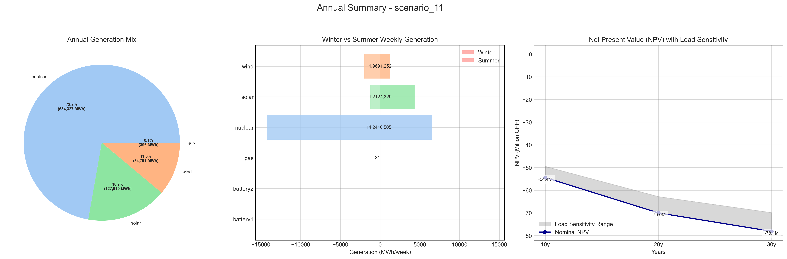

# Scenario Analysis Report: scenario_11
Generated on: 2025-01-29 17:38:09

## Overview

## Seasonal Generation Patterns

## Financial Analysis
| Metric | Value |
|--------|--------|
| Initial Investment | €22,290,920.00 |
| Annual Operating Cost | €2,774,809.44 |
| NPV (10 years) | €-54,397,565.91 |
| NPV (20 years) | €-69,982,457.64 |
| NPV (30 years) | €-78,099,192.17 |

## Generation Analysis

### Annual Generation by Asset Type
| Asset Type | Generation (MWh) |
|------------|-----------------|
| nuclear | 554,327.25 |
| solar | 127,910.15 |
| battery1 | nan |
| wind | 84,791.05 |
| gas | 396.65 |
| battery2 | nan |

### Generation Costs
| Asset Type | Cost (€) |
|------------|----------|
| cost_nuclear | 2,771,636.24 |
| cost_solar | 0.00 |
| cost_battery1 | nan |
| cost_wind | 0.00 |
| cost_gas | 3,173.19 |
| cost_battery2 | nan |

### Capacity Factors
| Asset Type | Capacity Factor |
|------------|----------------|
| nuclear | 7.93% |
| solar | 0.00% |
| battery1 | nan% |
| wind | 123.40% |
| gas | 0.02% |
| battery2 | nan% |

## AI Critical Analysis
# Scenario Analysis: scenario_11_nominal

## Economic Efficiency
The economic efficiency of the generation mix in this scenario raises concerns, particularly due to the substantial annual cost of approximately $2.77 million, paired with a notable dependency on nuclear energy for generation output. The zero-cost generation from solar and wind indicates an underutilization of these renewable resources, which could significantly enhance system cost-effectiveness. The high generation costs associated with nuclear and gas further limit economic sustainability, highlighting the need for a more balanced energy strategy.

## System Composition Strengths/Weaknesses
Strengths of this mix include the reliability of nuclear energy, which forms the backbone of generation. However, weaknesses are evident, with solar and wind underperforming in terms of contribution and cost, and gas generation being minimal. In addition, the presence of undefined metrics for battery storage systems reflects a lack of clarity on their potential benefits and role.

## Key Recommendations for Improvement
1. Enhance the integration of solar and wind resources to leverage their zero marginal costs effectively, aiming for a more balanced mix to reduce overall operational costs.
2. Invest in battery storage systems to increase resilience and support renewable generation, thereby addressing intermittency issues.
3. Conduct further analysis to optimize the generation mix, considering real-time data on demand and generation capacity to fine-tune performance.

---
