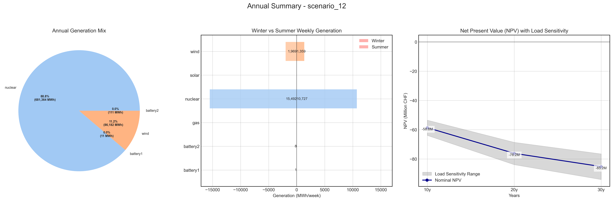
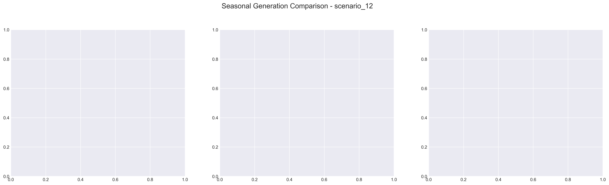

# Scenario Analysis Report: scenario_12
Generated on: 2025-01-29 17:38:44

## Overview

## Seasonal Generation Patterns

## Financial Analysis
| Metric | Value |
|--------|--------|
| Initial Investment | €22,290,920.00 |
| Annual Operating Cost | €3,406,823.09 |
| NPV (10 years) | €-58,638,428.92 |
| NPV (20 years) | €-76,187,660.78 |
| NPV (30 years) | €-85,214,264.87 |

## Generation Analysis

### Annual Generation by Asset Type
| Asset Type | Generation (MWh) |
|------------|-----------------|
| nuclear | 681,364.62 |
| solar | nan |
| battery1 | -11.19 |
| wind | 86,182.86 |
| gas | 0.00 |
| battery2 | -111.19 |

### Generation Costs
| Asset Type | Cost (€) |
|------------|----------|
| cost_nuclear | 3,406,823.09 |
| cost_solar | nan |
| cost_battery1 | 0.00 |
| cost_wind | 0.00 |
| cost_gas | 0.00 |
| cost_battery2 | 0.00 |

### Capacity Factors
| Asset Type | Capacity Factor |
|------------|----------------|
| nuclear | 9.75% |
| solar | nan% |
| battery1 | -0.00% |
| wind | 125.43% |
| gas | 0.00% |
| battery2 | -0.02% |

## AI Critical Analysis
# Scenario Analysis Results: Scenario Name - scenario_12_nominal

## Economic Efficiency of the Generation Mix
The annual operational cost stands at approximately $3.41 million, predominantly attributed to nuclear generation, which suggests a heavy reliance on this single source. However, the cost-effectiveness appears questionable, given that the capacity factor for nuclear is relatively low at 9.7%. This leads to concerns about the overall output’s reliability and efficiency, particularly as solar and gas are underrepresented in this mix.

## System Composition Strengths/Weaknesses
Strengths include the wind generation, boasting a capacity factor of 125.4%, suggesting excellent output efficiency during operation. Conversely, the significant negative values associated with battery systems indicate potential over-deployment or ineffective integration, leading to energy losses. There is no operational contribution from solar and gas, presenting a critical weakness by over-relying on nuclear and underutilizing diverse resources, which could ensure better resilience and stability in the energy mix.

## Key Recommendations for Improvement
To enhance economic efficiency and system reliability, it is recommended to increase investments in solar and gas capabilities to diversify the energy portfolio. Integrating energy storage systems effectively is crucial; thus, recalibrating their deployment could mitigate losses. Finally, regular assessments of capacity factors and adjustments to operational strategies should be conducted to optimize performance across all asset types.

---
