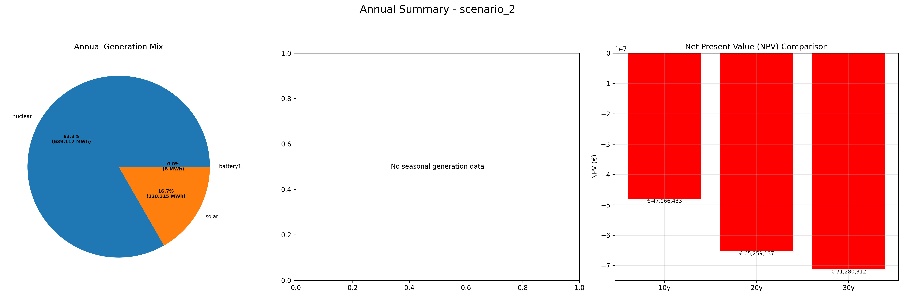
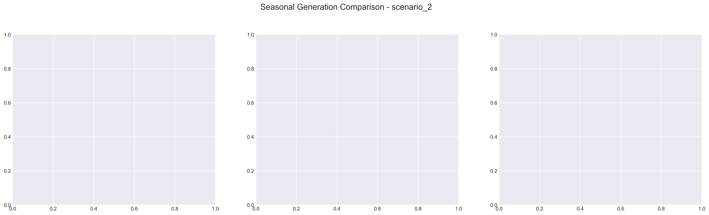

# Scenario Analysis Report: scenario_2
Generated on: 2025-01-16 13:31:33

## Overview

## Seasonal Generation Patterns

## Financial Analysis
| Metric | Value |
|--------|--------|
| Initial Investment | €22,290,920.00 |
| Annual Operating Cost | €3,195,590.21 |
| NPV (10 years) | €-57,221,039.12 |
| NPV (20 years) | €-74,113,745.25 |
| NPV (30 years) | €-82,836,250.90 |

## Generation Analysis

### Annual Generation by Asset Type
| Asset Type | Generation (MWh) |
|------------|-----------------|
| nuclear | 639,118.04 |
| solar | 128,315.64 |
| battery1 | -8.58 |
| wind | nan |
| gas | nan |
| battery2 | nan |

### Generation Costs
| Asset Type | Cost (€) |
|------------|----------|
| cost_nuclear | 3,195,590.21 |
| cost_solar | 0.00 |
| cost_battery1 | 0.00 |
| cost_wind | nan |
| cost_gas | nan |
| cost_battery2 | nan |

### Capacity Factors
| Asset Type | Capacity Factor |
|------------|----------------|
| nuclear | 9.14% |
| solar | 0.00% |
| battery1 | -0.00% |
| wind | nan% |
| gas | nan% |
| battery2 | nan% |

## AI Critical Analysis
## Critical Analysis of Scenario 2: Nominal

### Economic Efficiency of the Generation Mix
The annual operational cost for this scenario is approximately $3.2 million, primarily driven by nuclear generation. However, the lack of generation from solar, wind, and gas raises concerns about the diversity of the generation mix. High reliance on a single source, like nuclear, can lead to vulnerabilities in price fluctuations and regulatory changes.

### System Composition Strengths/Weaknesses
Strengths include the existing nuclear capacity, which provides a significant amount of generation (639,118 MW). Nonetheless, weaknesses are evident with underperforming solar and a total absence of wind and gas generation. This limits flexibility and resilience, failing to leverage renewables' low operational costs and environmental benefits. Capacity factors for solar and battery systems are ineffective, indicating inefficiency in harnessing available generation potential.

### Key Recommendations for Improvement
To enhance the system's economic efficiency and resilience, diversifying the generation mix is crucial. Increasing solar installations and integrating wind can significantly lower costs and improve capacity factors. Moreover, investment in energy storage systems should be prioritized to mitigate the impact of intermittency and improve system reliability. A detailed evaluation of gas generation as a transitional technology could also enhance flexibility and support renewable integration.

---
