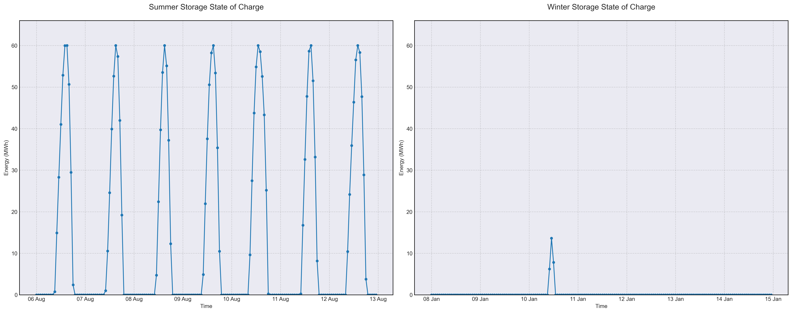

# Scenario Analysis Report: scenario_2
Generated on: 2025-02-15 11:32:16

## Overview

## Financial Analysis
| Metric | Value |
|--------|--------|
| Initial Investment | CHF nan |
| Annual Operating Cost | CHF 1,300,109 |
| NPV (10 years) | CHF nan |
| NPV (20 years) | CHF nan |
| NPV (30 years) | CHF nan |

## Generation Analysis

### Annual Generation by Asset Type
| Asset Type | Generation (MWh) |
|------------|-----------------|
| nuclear | 260'018 |
| solar | 123'023 |
| battery1 | -164 |

### Generation Costs
| Asset Type | Cost (CHF) |
|------------|------------|
| cost_nuclear | 1'300'092 |

## Storage State of Charge

## AI Critical Analysis
### Critical Analysis of Scenario 2 - Nominal

**Economic Efficiency of the Generation Mix**  
The total annual cost of $1,300,108.80 primarily stems from nuclear generation, which, despite its substantial output of 260,018.49 MW, incurs significant operational expenses. The absence of costs associated with both solar and battery storage systems suggests either a subsidy mechanism or underutilization. Given a low capacity factor for nuclear at only 3.72%, the scenario indicates that the high costs may not translate into effective economic efficiency.

**System Composition Strengths/Weaknesses**  
The strategy heavily leans on nuclear energy as the main asset, demonstrating strength in high generation quantity but weakness in reliability and economic adaptability, particularly highlighted by nuclear's low capacity factor. The solar and battery investments appear underdeveloped and contribute minimally to generation, reflecting an unbalanced energy mix. The data for wind generation is absent, indicating a missed opportunity for diversification.

**Key Recommendations for Improvement**  
To enhance economic efficiency, it is crucial to incorporate higher capacity factors through optimized energy generation from solar and wind. Investments in energy storage solutions like batteries should be improved to balance the intermittency of solar and wind energy. A re-evaluation of the generation strategy to include a broader mix can foster resilience and cost-effectiveness in the energy system.

---
