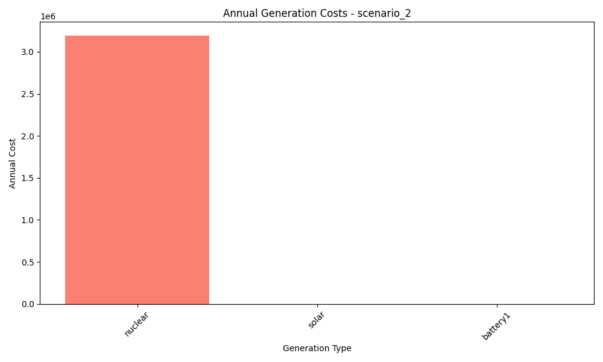
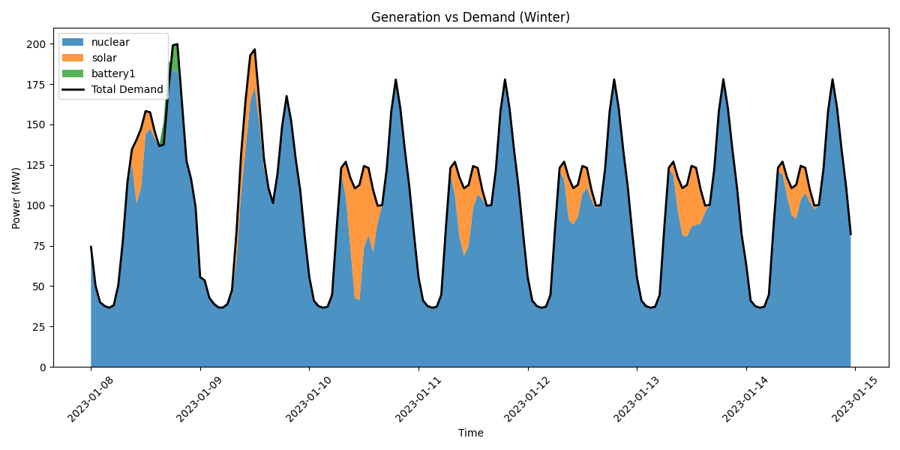

# Scenario Analysis Report: scenario_2
Generated on: 2024-12-30 01:27

## Investment Analysis
- Net Present Value (NPV): 10,461,142.86
- Annuity: 1,222,170.56
- Initial Investment: 22,290,920.00
- Annual Operating Cost: 3,195,590.20

## Annual Generation Overview


## Annual Cost Overview


## Seasonal Generation Patterns


## Generation Statistics

### Generation per Asset
```
nuclear: 639118.0
solar: 128315.6
cost_nuclear: 3195590.2
cost_solar: 0.0
battery1: -8.6
cost_battery1: 0.0
wind: nan
cost_wind: nan
battery2: nan
cost_battery2: nan
```

### Generation Costs per Asset
```
cost_nuclear: 3195590.2
cost_solar: 0.0
cost_battery1: 0.0
cost_wind: nan
cost_battery2: nan
```

### Capacity Factors
```
nuclear: 0.0
solar: 0.0
battery1: -0.01
wind: nan
battery2: nan
```

## AI Critical Analysis
# Critical Analysis of Scenario 2

## Economic Efficiency
The annual cost of $3,195,590.2, primarily attributed to nuclear generation, suggests significant financial implications. However, the generation reports show concerning discrepancies, particularly with solar and battery systems yielding zero output, leading to inefficient capital use. Notably, the capacity factors for both nuclear and solar are marked as zero, indicating no effective energy production and raising questions about the economic efficiency of this generation mix.

## System Composition Strengths/Weaknesses
The reliance on nuclear energy reflects a strength in terms of potential high output; however, its zero capacity factor indicates operational failures or mismanagement. Conversely, the inclusion of solar and battery technologies is commendable for diversification but underperformance hampers the overall system reliability. Wind generation appears to be completely absent from the data—highlighting a significant gap in renewable resources.

## Recommendations for Improvement
To enhance economic efficiency and reliability, recommendations include:
1. **Address Operational Inefficiencies:** Investigate the causes of zero output from both nuclear and solar and rectify operational issues.
2. **Integrate Wind Resources:** Incorporate wind generation to diversify energy sources, bolstering reliability and sustainability potential.
3. **Optimize Battery Storage:** Evaluate and improve the deployment of battery systems to ensure they contribute effectively to energy stability.

---
