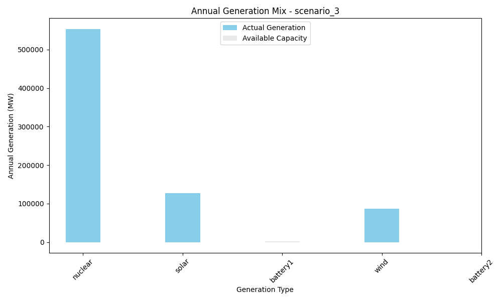
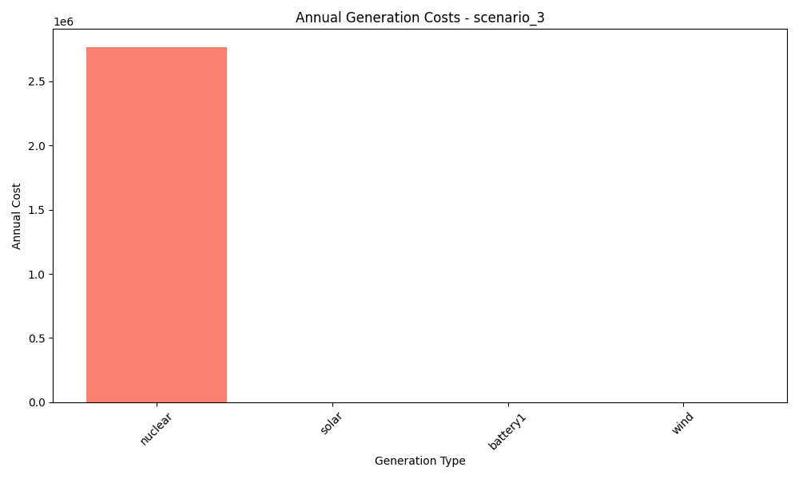
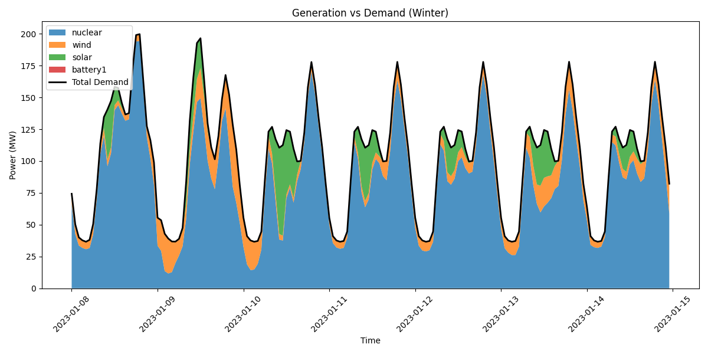

# Scenario Analysis Report: scenario_3
Generated on: 2024-12-30 01:27

## Investment Analysis
- Net Present Value (NPV): 6,810,568.86
- Annuity: 795,675.66
- Initial Investment: 22,290,920.00
- Annual Operating Cost: 2,769,095.30

## Annual Generation Overview


## Annual Cost Overview


## Seasonal Generation Patterns


## Generation Statistics

### Generation per Asset
```
nuclear: 553819.1
solar: 127441.6
cost_nuclear: 2769095.3
cost_solar: 0.0
battery1: -18.4
cost_battery1: 0.0
wind: 86182.9
cost_wind: 0.0
battery2: nan
cost_battery2: nan
```

### Generation Costs per Asset
```
cost_nuclear: 2769095.3
cost_solar: 0.0
cost_battery1: 0.0
cost_wind: 0.0
cost_battery2: nan
```

### Capacity Factors
```
nuclear: 0.0
solar: 0.0
battery1: -0.01
wind: 0.0
battery2: nan
```

## AI Critical Analysis
## Scenario 3 Analysis

### Economic Efficiency
The annual operational cost of $2,769,095.30 is significant, and given that nuclear, solar, wind, and battery systems exhibit either zero or non-existent generation, the economic efficiency of this generation mix is highly questionable. The apparent lack of actual generation from most assets leads to little to no return on investment.

### System Composition Strengths/Weaknesses
**Strengths:** The inclusion of nuclear technology typically suggests a commitment to stable, high-output generation. 

**Weaknesses:** The data reveals several critical issues, including:
- Nuclear and solar report substantial outputs without generating any income, which suggests either a reporting error or ineffective management.
- The substantial loss indicated by "battery1" and non-values for "battery2" suggest systemic dysfunction within the energy storage component, required for balancing intermittent resources such as wind and solar.
- The absence of any productive wind or solar energy, combined with the zero capacity factors across most technologies, reflects a severe inefficiency in the current setup.

### Recommendations
The system must be reassessed to identify and rectify the mismanagement or technical failures of each energy asset. Increased investment in properly functioning renewable sources and robust energy storage solutions is needed. Additionally, performing a thorough evaluation of the economic viability of each generation type would promote a more balanced and productive energy portfolio.

---
