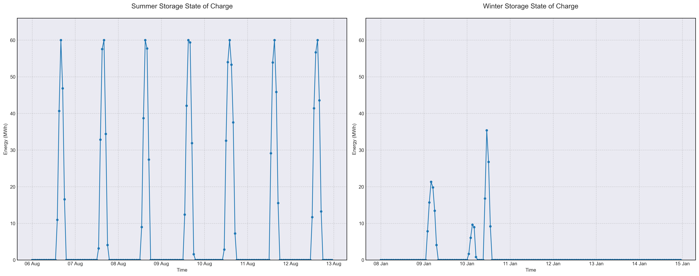

# Scenario Analysis Report: scenario_3
Generated on: 2025-02-15 11:32:21

## Overview

## Financial Analysis
| Metric | Value |
|--------|--------|
| Initial Investment | CHF nan |
| Annual Operating Cost | CHF 980,376 |
| NPV (10 years) | CHF nan |
| NPV (20 years) | CHF nan |
| NPV (30 years) | CHF nan |

## Generation Analysis

### Annual Generation by Asset Type
| Asset Type | Generation (MWh) |
|------------|-----------------|
| nuclear | 196'070 |
| solar | 107'166 |
| battery1 | -275 |
| wind | 79'752 |

### Generation Costs
| Asset Type | Cost (CHF) |
|------------|------------|
| cost_nuclear | 980'349 |

## Storage State of Charge

## AI Critical Analysis
# Scenario Analysis: Scenario 3 Nominal

## Critical Analysis

### Economic Efficiency
The annual cost of $980,376 suggests a relatively efficient operation; however, the solar and battery assets have zero generation costs and outputs. This inefficiency raises concerns regarding the dependency on nuclear and wind energy, which indicates potential volatility due to reliance on limited sources. Additionally, the nuclear generation cost appears significantly high given the low capacity factor (2.8%), indicating underutilization of this asset.

### System Composition Strengths/Weaknesses
The system shows strengths in wind energy, with a high capacity factor of 116%, demonstrating potential for reliability and output. However, the weaknesses are pronounced: solar and battery assets are non-operational, indicating underinvestment or technical hurdles. This lack of diversity makes the energy mix susceptible to risks, particularly in periods of low wind or nuclear operational challenges.

### Recommendations for Improvement
1. **Enhance Solar and Battery Integration**: Invest in solar technology development and battery efficiency to improve generation capability and energy storage, respectively.
2. **Diversify Energy Mix**: Include additional renewable sources or energy storage solutions to minimize dependency on nuclear and wind energy, increasing overall resilience.
3. **Optimize Nuclear Operations**: Evaluate operational strategies for nuclear assets to enhance capacity factor and decrease costs.

---
