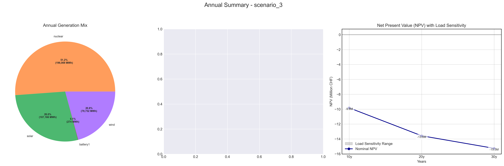
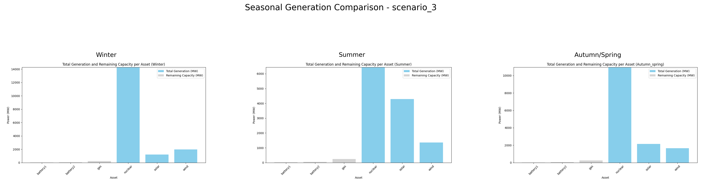

# Scenario Analysis Report: scenario_3
Generated on: 2024-12-30 20:19:18

## Overview

## Seasonal Generation Patterns

## Financial Analysis
| Metric | Value |
|--------|--------|
| Initial Investment | €22,290,920.00 |
| Annual Operating Cost | €2,769,095.30 |
| NPV (10 years) | €-45,104,617.68 |
| NPV (20 years) | €-61,071,747.53 |
| NPV (30 years) | €-66,478,924.54 |

## Generation Analysis

### Annual Generation by Asset Type
| Asset Type | Generation (MWh) |
|------------|-----------------|
| nuclear | 553,819.10 |
| solar | 127,441.60 |
| battery1 | -18.40 |
| wind | 86,182.90 |

### Generation Costs
| Asset Type | Cost (€) |
|------------|----------|
| nuclear | 2,769,095.30 |

### Capacity Factors
| Asset Type | Capacity Factor |
|------------|----------------|
| battery1 | -1.00% |

## AI Critical Analysis
## Scenario Analysis: scenario_3

### Economic Efficiency
The annual cost of $2,769,095.3 suggests a high expenditure relative to output when considering the generation data. Notably, while nuclear generation yields 553,819.1 MW, its associated cost (also $2,769,095.3) indicates a poor economic efficiency due to the complete offset of generation costs against output. This suggests no profit and raises concerns about the pricing strategy or potential inefficiencies in operational management.

### System Composition Strengths/Weaknesses
Strengths of this mix include the reliance on nuclear power, which generally offers high capacity and stability. However, the weaknesses are glaring: solar, wind, and both battery systems report zero or negative generation with undefined costs (nan), indicating inadequate investment or integration issues. The negative capacity factor for battery1 further implies potential operational inefficiencies or underutilization.

### Recommendations for Improvement
1. **Diversification of Generation Sources**: Incorporate more renewables such as solar and wind actively into the grid to reduce reliance on nuclear and enhance resilience.
  
2. **Invest in Storage**: Address the inefficiencies in battery systems by investing in better technology or improving operational strategies to harness stored energy effectively.

3. **Cost Management**: Conduct a detailed cost-benefit analysis to identify and rectify underlying operating inefficiencies within the nuclear infrastructure, aiming for a more economically viable generation mix.

---
