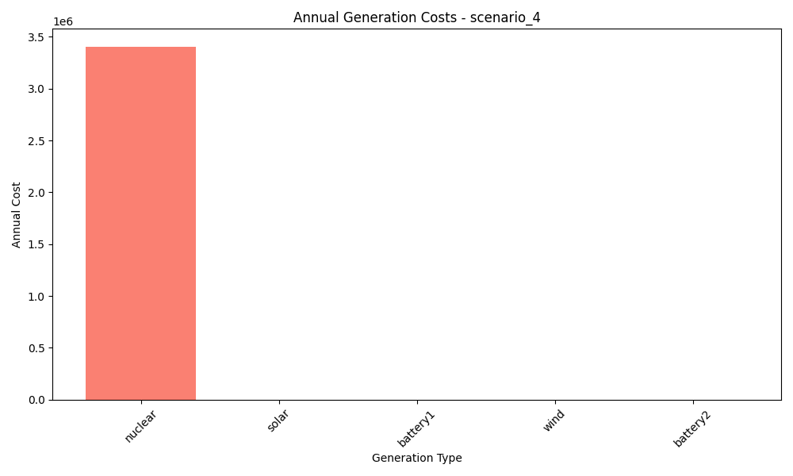

# Scenario Analysis Report: scenario_4
Generated on: 2024-12-30 01:27

## Investment Analysis
- Net Present Value (NPV): 12,264,287.78
- Annuity: 1,432,831.16
- Initial Investment: 22,290,920.00
- Annual Operating Cost: 3,406,250.80

## Annual Generation Overview


## Annual Cost Overview


## Seasonal Generation Patterns


## Generation Statistics

### Generation per Asset
```
nuclear: 681250.2
solar: nan
cost_nuclear: 3406250.8
cost_solar: nan
battery1: -7.9
cost_battery1: 0.0
wind: 86182.9
cost_wind: 0.0
battery2: 0.0
cost_battery2: 0.0
```

### Generation Costs per Asset
```
cost_nuclear: 3406250.8
cost_solar: nan
cost_battery1: 0.0
cost_wind: 0.0
cost_battery2: 0.0
```

### Capacity Factors
```
nuclear: 0.0
solar: nan
battery1: -0.01
wind: 0.0
battery2: 0.0
```

## AI Critical Analysis
# Scenario Analysis for Scenario 4

## Economic Efficiency of the Generation Mix
The annual cost of $3,406,250.8 indicates a significant investment primarily in nuclear energy. However, the generation per asset reveals that the mix is heavily reliant on nuclear, with a substantial contribution of 681,250.2 MW. This presents a concern for economic efficiency, particularly considering the absence of output from renewable sources such as solar and wind, which typically have lower operational costs.

## System Composition Strengths/Weaknesses
**Strengths:**
- The dominant nuclear generation provides a consistent base load, which is valuable for grid stability.

**Weaknesses:**
- Solar and wind generation are not contributing, resulting in underutilization of potential low-cost renewables. Additionally, the negative output for battery systems suggests that energy storage strategies are poorly integrated or mismanaged.

## Key Recommendations for Improvement
1. **Diversify Generation Sources:** Aim to incorporate functional solar and wind systems to capitalize on renewable energy potential and decrease reliance on nuclear.
2. **Optimize Battery Utilization:** Address the issues causing negative generation for battery systems to enhance reliability and support grid applications.
3. **Explore Operational Enhancements:** Investigate the economic feasibility of hybridizing energy generation with renewables to improve overall cost-effectiveness and reduce carbon emissions.

---
