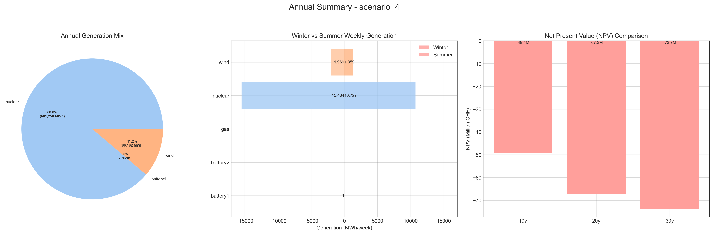
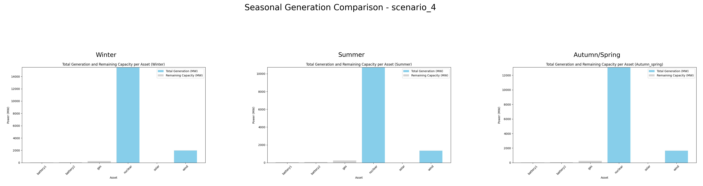

# Scenario Analysis Report: scenario_4
Generated on: 2024-12-30 20:33:41

## Overview

## Seasonal Generation Patterns

## Financial Analysis
| Metric | Value |
|--------|--------|
| Initial Investment | €22,290,920.00 |
| Annual Operating Cost | €3,406,250.80 |
| NPV (10 years) | €-49,379,982.95 |
| NPV (20 years) | €-67,327,434.15 |
| NPV (30 years) | €-73,651,883.12 |

## Generation Analysis

### Annual Generation by Asset Type
| Asset Type | Generation (MWh) |
|------------|-----------------|
| nuclear | 681,250.20 |
| battery1 | -7.90 |
| wind | 86,182.90 |

### Generation Costs
| Asset Type | Cost (€) |
|------------|----------|
| nuclear | 3,406,250.80 |

### Capacity Factors
| Asset Type | Capacity Factor |
|------------|----------------|
| battery1 | -1.00% |

## AI Critical Analysis
# Scenario_4 Analysis

## Economic Efficiency
The annual cost of scenario_4 is $3,406,250.8, predominantly driven by nuclear generation, yet its reported generation of 681,250.2 MW leads to a questionable cost-effectiveness. A zero capacity factor for nuclear implies that the plant is not operational or underutilized, raising concerns about economic viability. Additionally, the absence of solar and wind generation, coupled with negative output from battery storage, suggests significant inefficiencies in the energy mix.

## System Composition Strengths/Weaknesses
Strengths:
- High nuclear generation potential (if operated effectively) could yield substantial energy output.

Weaknesses:
- The complete reliance on nuclear without operational capacity and the failure to utilize renewable energy sources limit diversification and sustainability.
- The negative generation from battery systems indicates a lack of effective energy storage, hampering grid reliability.

## Recommendations for Improvement
1. **Diversification**: Integrate a balanced mix of solar and wind resources to harness renewable energy and improve capacity factors. 
2. **Operational Strategy**: Reassess the operational strategies for the nuclear assets, ensuring they run at optimal levels and address any maintenance issues.
3. **Energy Storage Enhancement**: Invest in improving battery systems to provide reliable energy during fluctuations in generation, effectively increasing grid stability.

---
