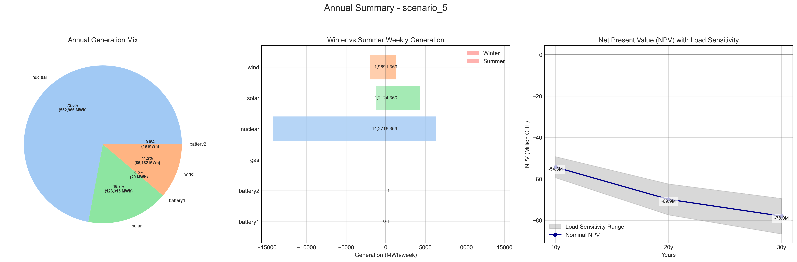

# Scenario Analysis Report: scenario_5
Generated on: 2025-02-15 10:51:02

## Overview

## Financial Analysis
| Metric | Value |
|--------|--------|
| Initial Investment | CHF 36,672,740 |
| Annual Operating Cost | CHF 905,287 |
| NPV (10 years) | CHF -68,844,458 |
| NPV (20 years) | CHF -88,117,920 |
| NPV (30 years) | CHF -96,134,125 |

## Generation Analysis

### Annual Generation by Asset Type
| Asset Type | Generation (MWh) |
|------------|-----------------|
| nuclear | 181'046 |
| solar | 119'421 |
| battery1 | -229 |
| wind | 82'827 |
| battery2 | -351 |

### Generation Costs
| Asset Type | Cost (CHF) |
|------------|------------|
| cost_nuclear | 905'230 |

## Storage State of Charge

## AI Critical Analysis
### Critical Analysis of Scenario: scenario_5_nominal

**Economic Efficiency of the Generation Mix:**
The annual cost of $905,287 indicates a relatively high operational burden, particularly given that most generation types, including solar, wind, and battery systems, report zero generation costs. However, the dependency on nuclear energy, which has both significant generation and cost, raises concerns about overall cost efficiency in the long run, especially with its low capacity factor of 2.59%. 

**System Composition Strengths/Weaknesses:**
The scenario showcases a strong reliance on nuclear power for generation but suffers from an over-reliance on it, presenting risks of operational inflexibility. Wind generation exhibits a high capacity factor (1.2), indicating its effective potential; however, anomalies in reported generation may suggest data integrity issues. Additionally, gas and battery systems show negative generation and capacity factors, which undermine reliability and indicate potential storage and generation inefficiencies.

**Key Recommendations for Improvement:**
1. **Data Validation:** Address data anomalies, particularly for gas and negative capacity factors in battery systems to ensure reliable generation reporting.
2. **Diversify the Mix:** Increase investment in solar and wind where feasible, as both show the potential for zero costs and higher operational efficiency.
3. **Enhance Battery Utilization:** Improve battery system management to ensure they contribute positively to storage and generation. This could stabilize supply and reduce dependency on nuclear power.

---
