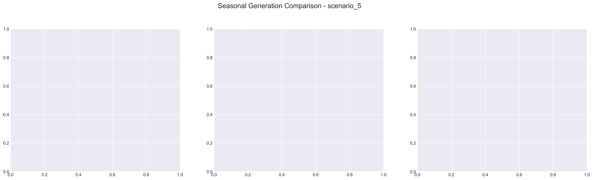

# Scenario Analysis Report: scenario_5
Generated on: 2025-01-29 17:36:39

## Overview

## Seasonal Generation Patterns

## Financial Analysis
| Metric | Value |
|--------|--------|
| Initial Investment | €22,290,920.00 |
| Annual Operating Cost | €2,764,832.27 |
| NPV (10 years) | €-54,330,618.27 |
| NPV (20 years) | €-69,884,500.29 |
| NPV (30 years) | €-77,986,871.33 |

## Generation Analysis

### Annual Generation by Asset Type
| Asset Type | Generation (MWh) |
|------------|-----------------|
| nuclear | 552,966.45 |
| solar | 128,315.64 |
| battery1 | -20.51 |
| wind | 86,182.86 |
| gas | nan |
| battery2 | -19.34 |

### Generation Costs
| Asset Type | Cost (€) |
|------------|----------|
| cost_nuclear | 2,764,832.27 |
| cost_solar | 0.00 |
| cost_battery1 | 0.00 |
| cost_wind | 0.00 |
| cost_gas | nan |
| cost_battery2 | 0.00 |

### Capacity Factors
| Asset Type | Capacity Factor |
|------------|----------------|
| nuclear | 7.91% |
| solar | 0.00% |
| battery1 | -0.01% |
| wind | 125.43% |
| gas | nan% |
| battery2 | -0.00% |

## AI Critical Analysis
### Critical Analysis of Scenario 5 Nominal

1. **Economic Efficiency of the Generation Mix**: The annual operational cost for this scenario is approximately $2.76 million, primarily attributed to nuclear generation, which, despite a surprisingly low output (553 MW), represents the entire cost structure. Solar and wind reportedly yield zero costs and zero generation, raising questions about the effectiveness of these assets in this scenario. The negative capacity factors for batteries further indicate inefficiency, suggesting possible issues in usage or configuration.

2. **System Composition Strengths/Weaknesses**: The reliance on nuclear provides a stable foundation, yet this scenario displays substantial weaknesses due to dependency on one technology. The zero output from solar and wind limits the diversification needed to mitigate risks associated with fuel price volatility or regulatory changes. The gas and battery systems lack clear data, adding uncertainty to their roles and potential contribution.

3. **Key Recommendations for Improvement**: To enhance economic efficiency, it is crucial to reassess the configurations of renewable systems, potentially integrating larger capacities or enhanced technologies for solar and wind. Furthermore, identifying and resolving the issues regarding the gas and battery storage systems could yield significant improvements in reliability and cost management. Incremental adaptations, such as improved energy storage solutions, could enhance capacity factors and overall system resilience.

---
