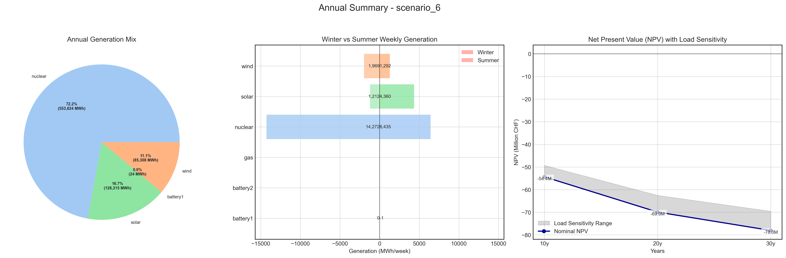
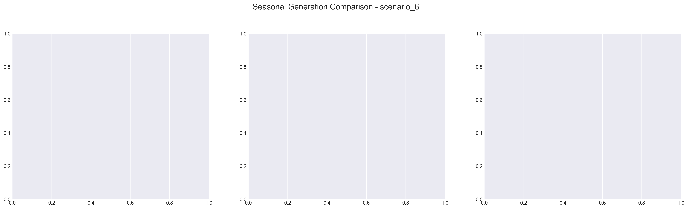

# Scenario Analysis Report: scenario_6
Generated on: 2025-01-29 17:37:55

## Overview

## Seasonal Generation Patterns

## Financial Analysis
| Metric | Value |
|--------|--------|
| Initial Investment | €22,290,920.00 |
| Annual Operating Cost | €2,769,124.39 |
| NPV (10 years) | €-54,359,418.79 |
| NPV (20 years) | €-69,926,641.03 |
| NPV (30 years) | €-78,035,191.16 |

## Generation Analysis

### Annual Generation by Asset Type
| Asset Type | Generation (MWh) |
|------------|-----------------|
| nuclear | 553,824.88 |
| solar | 128,315.64 |
| battery1 | -24.19 |
| wind | 85,308.77 |
| gas | nan |
| battery2 | nan |

### Generation Costs
| Asset Type | Cost (€) |
|------------|----------|
| cost_nuclear | 2,769,124.39 |
| cost_solar | 0.00 |
| cost_battery1 | 0.00 |
| cost_wind | 0.00 |
| cost_gas | nan |
| cost_battery2 | nan |

### Capacity Factors
| Asset Type | Capacity Factor |
|------------|----------------|
| nuclear | 7.92% |
| solar | 0.00% |
| battery1 | -0.01% |
| wind | 124.15% |
| gas | nan% |
| battery2 | nan% |

## AI Critical Analysis
# Critical Analysis of Scenario 6 Nominal

**1. Economic Efficiency of the Generation Mix:**  
The annual operational cost of approximately $2.77 million suggests a potentially high cost given the low energy outputs, particularly from solar and wind assets, which report zero generation costs despite significant operational input. The nuclear asset, while efficiently providing substantial generation (553,824.88 MW), carries the entire operational cost burden, indicating possible economic inefficiency in this narrow reliance on one technology.

**2. System Composition Strengths/Weaknesses:**  
Strengths lie in the nuclear generation's stable output and capacity factor (7.92%), essential for baseline load. However, weaknesses are notable—zero performance from solar, wind efficiency exceeding 100% capacity factor, and absence of data for gas and battery systems, which constrains flexibility and resilience during peak demands or outages.

**3. Key Recommendations for Improvement:**  
1. Diversify the renewable energy portfolio to include operational solar and gas generation. 
2. Provide analytical clarity on battery technologies to enhance peaking support and storage capabilities. 
3. Investigate potential upgrades in wind generation efficiency, preventing over-forecasting of capacity. 
4. Establish cost structures for gas and battery systems to allow better economic assessments and risk management. Adopting these measures will create a more balanced and resilient energy mix.

---
