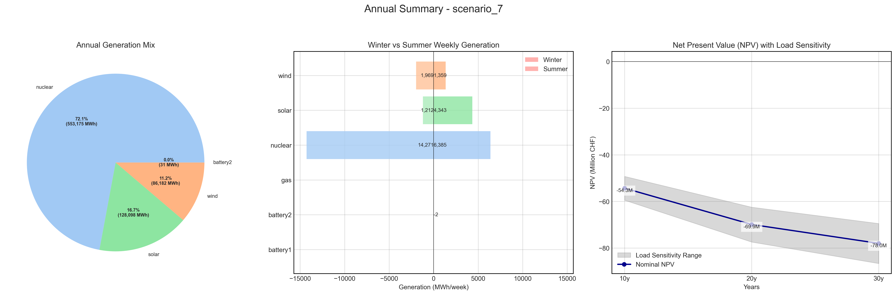
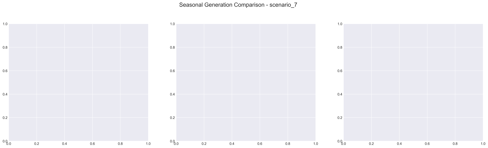

# Scenario Analysis Report: scenario_7
Generated on: 2025-01-29 17:37:41

## Overview

## Seasonal Generation Patterns

## Financial Analysis
| Metric | Value |
|--------|--------|
| Initial Investment | €22,290,920.00 |
| Annual Operating Cost | €2,765,877.81 |
| NPV (10 years) | €-54,337,633.93 |
| NPV (20 years) | €-69,894,765.55 |
| NPV (30 years) | €-77,998,641.78 |

## Generation Analysis

### Annual Generation by Asset Type
| Asset Type | Generation (MWh) |
|------------|-----------------|
| nuclear | 553,175.56 |
| solar | 128,098.12 |
| battery1 | nan |
| wind | 86,182.86 |
| gas | nan |
| battery2 | -31.44 |

### Generation Costs
| Asset Type | Cost (€) |
|------------|----------|
| cost_nuclear | 2,765,877.81 |
| cost_solar | 0.00 |
| cost_battery1 | nan |
| cost_wind | 0.00 |
| cost_gas | nan |
| cost_battery2 | 0.00 |

### Capacity Factors
| Asset Type | Capacity Factor |
|------------|----------------|
| nuclear | 7.92% |
| solar | 0.00% |
| battery1 | nan% |
| wind | 125.43% |
| gas | nan% |
| battery2 | -0.01% |

## AI Critical Analysis
## Critical Analysis of Scenario 7: Nominal

### Economic Efficiency of the Generation Mix
The annual operational cost of approximately $2.77 million is significantly driven by nuclear generation, which represents a substantial output of 553,176 MW. However, the cost associated with solar, wind, and battery generation is reported as zero, which raises concerns about the system's economic efficiency. This discrepancy may indicate missing data or inefficiencies that skew cost analyses.

### System Composition Strengths/Weaknesses
Strengths include the reliance on nuclear energy, which provides a stable percentage of generation with a reasonable capacity factor. Nonetheless, the presence of non-viable metrics for solar, gas, and batteries casts doubt on the mix's reliability and effectiveness. The exceptionally high capacity factor for wind raises concerns regarding potential over-reliance on this source without appropriate backup.

### Key Recommendations for Improvement
1. **Data Integrity**: Review the input data for solar, gas, and battery systems to ensure accurate representation of their operational costs and generation capacities.
2. **Diversification**: Explore enhancing solar and gas generation to balance the fixed nature of nuclear and the variable nature of wind.
3. **Capacity Optimization**: Assess the capacity factors of all assets to optimize the generation mix, minimize reliance on any single technology, and ensure grid reliability during demand peaks.

---
