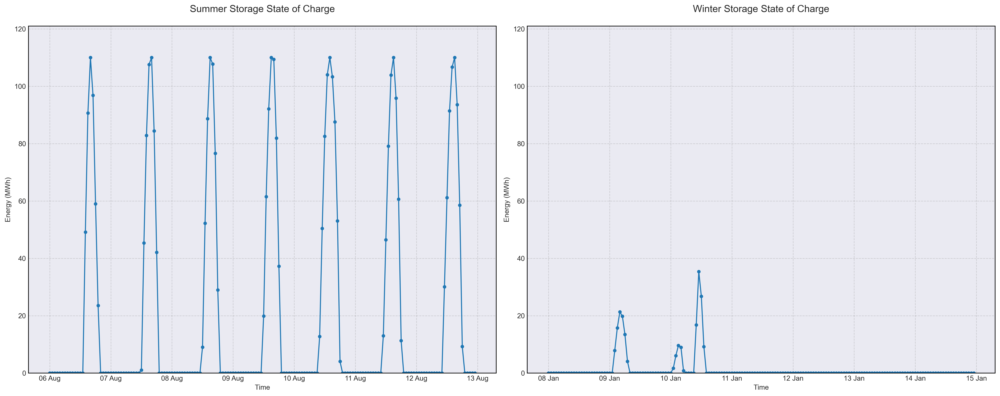

# Scenario Analysis Report: scenario_7
Generated on: 2025-02-15 10:51:07

## Overview

## Financial Analysis
| Metric | Value |
|--------|--------|
| Initial Investment | CHF 36,672,740 |
| Annual Operating Cost | CHF 942,766 |
| NPV (10 years) | CHF -69,095,941 |
| NPV (20 years) | CHF -88,485,889 |
| NPV (30 years) | CHF -96,556,049 |

## Generation Analysis

### Annual Generation by Asset Type
| Asset Type | Generation (MWh) |
|------------|-----------------|
| nuclear | 188'545 |
| solar | 108'715 |
| wind | 85'881 |
| battery2 | -428 |

### Generation Costs
| Asset Type | Cost (CHF) |
|------------|------------|
| cost_nuclear | 942'723 |

## Storage State of Charge

## AI Critical Analysis
# Scenario Analysis: scenario_7_nominal

## Critical Analysis

### Economic Efficiency of Generation Mix
The economic efficiency of the generation mix in scenario 7 is concerning, particularly due to the high annual operational cost of $942,765. The nuclear generation, while robust, accounts for nearly all of the costs at $942,723, highlighting a potential inefficiency in relying heavily on this single source. The presence of zero-cost solar generation raises questions about the viability of solar assets being fully utilized.

### System Composition Strengths/Weaknesses
Strengths include the significant contribution from nuclear power, which provides a substantial portion of generation. However, weaknesses are evident, particularly with the wind capacity factor exceeding 1, indicating possible data inaccuracies, and negative battery generation, suggesting operational issues. Furthermore, the absence of meaningful contributions from solar and gas indicates a lack of diversity in the energy mix, which is crucial for resilience and developing a reliable supply.

### Key Recommendations for Improvement
To improve the mix's economic efficiency and resilience, it is recommended to enhance solar deployment and investigate operational problems in wind and battery systems. Implementing a diversified strategy that includes cost-effective gas generation and enhanced storage solutions could reduce operational costs and improve overall reliability. Comprehensive data validation is also essential to ensure accuracy in capacity factors and generation metrics.

---
