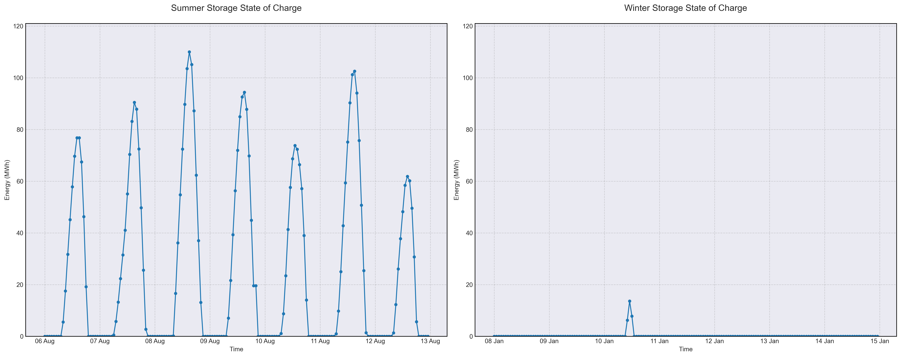

# Scenario Analysis Report: scenario_8
Generated on: 2025-02-15 10:51:29

## Overview

## Financial Analysis
| Metric | Value |
|--------|--------|
| Initial Investment | CHF 36,672,740 |
| Annual Operating Cost | CHF 1,275,673 |
| NPV (10 years) | CHF -71,329,778 |
| NPV (20 years) | CHF -91,754,424 |
| NPV (30 years) | CHF -100,303,850 |

## Generation Analysis

### Annual Generation by Asset Type
| Asset Type | Generation (MWh) |
|------------|-----------------|
| nuclear | 255'130 |
| solar | 128'011 |
| battery2 | -214 |

### Generation Costs
| Asset Type | Cost (CHF) |
|------------|------------|
| cost_nuclear | 1'275'652 |

## Storage State of Charge

## AI Critical Analysis
# Scenario Analysis: Scenario 8 - Nominal

## Economic Efficiency
The economic efficiency of scenario_8_nominal appears significantly compromised. With an annual cost of approximately $1.28 million and substantial reliance on nuclear generation, the lack of diversified and cost-effective generation sources raises concerns. Notably, solar assets show zero generation and costs, which highlights an underutilization or failure in the solar components of the mix. The generation costs linked to nuclear raise questions about long-term sustainability, especially with a capacity factor of just 3.65%.

## System Composition Strengths/Weaknesses
Strengths of this scenario include a clear reliance on nuclear generation, which can provide stable baseload power. However, the weaknesses are pronounced: the energy mix lacks versatility due to absent contributions from solar, gas, wind, and battery systems. The negative capacity factor for battery2 indicates ineffective management, further undermining potential energy storage benefits.

## Recommendations for Improvement
To enhance this energy scenario, it is crucial to diversify the generation mix by investing in reliable renewable sources such as wind and solar, alongside enhancing battery storage capabilities. Additionally, optimizing the existing assets' capacity factors can lead to improved operational efficiency. Regular assessments and technology upgrades could also ensure a more balanced, resilient energy portfolio.

---
