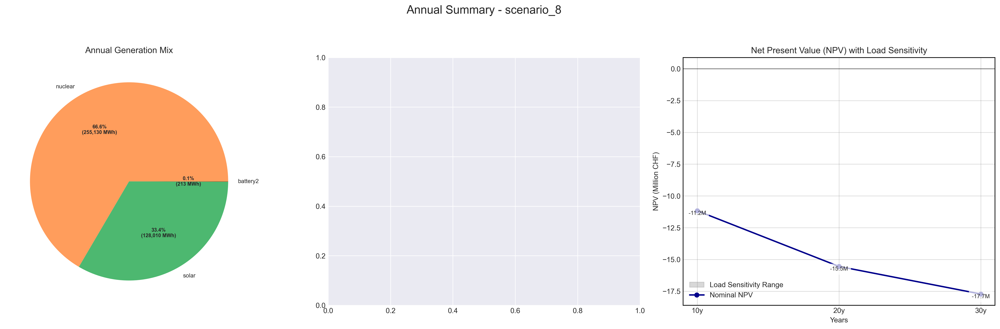
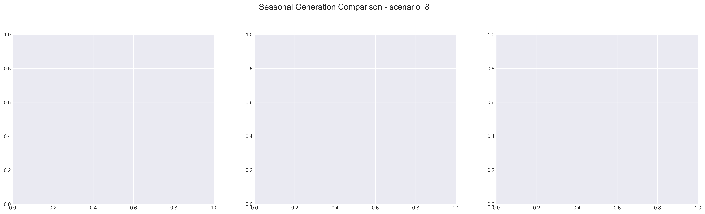

# Scenario Analysis Report: scenario_8
Generated on: 2025-01-29 17:38:23

## Overview

## Seasonal Generation Patterns

## Financial Analysis
| Metric | Value |
|--------|--------|
| Initial Investment | €22,290,920.00 |
| Annual Operating Cost | €3,195,547.95 |
| NPV (10 years) | €-57,220,755.56 |
| NPV (20 years) | €-74,113,330.34 |
| NPV (30 years) | €-82,835,775.15 |

## Generation Analysis

### Annual Generation by Asset Type
| Asset Type | Generation (MWh) |
|------------|-----------------|
| nuclear | 639,109.59 |
| solar | 128,315.64 |
| battery1 | -0.13 |
| wind | nan |
| gas | 0.00 |
| battery2 | 0.00 |

### Generation Costs
| Asset Type | Cost (€) |
|------------|----------|
| cost_nuclear | 3,195,547.95 |
| cost_solar | 0.00 |
| cost_battery1 | 0.00 |
| cost_wind | nan |
| cost_gas | 0.00 |
| cost_battery2 | 0.00 |

### Capacity Factors
| Asset Type | Capacity Factor |
|------------|----------------|
| nuclear | 9.14% |
| solar | 0.00% |
| battery1 | -0.00% |
| wind | nan% |
| gas | 0.00% |
| battery2 | 0.00% |

## AI Critical Analysis
## Critical Analysis of Scenario 8

### Economic Efficiency of the Generation Mix
The analysis reveals a heavy reliance on nuclear energy, generating a substantial output (639,109.59 MW) at a notably high operational cost of approximately $3.2 million. The absence of cost and generation from solar, gas, and wind indicates potential inefficiencies, suggesting underutilization of renewable resources and energy diversification that might lower overall costs.

### System Composition Strengths/Weaknesses
The predominant use of nuclear generation provides a consistent and substantial energy output, indicating strength in baseload capacity. However, the complete absence of generation from solar, wind, and gas undermines resilience and adaptability. The negative capacity factor for battery 1 suggests inefficiencies or operational issues within the battery storage system, further weakening the scenario’s overall effectiveness.

### Key Recommendations for Improvement
1. **Diversify generation sources:** Incorporate solar and wind investments to capitalize on renewable energy and improve system resilience.
2. **Enhance storage capabilities:** Focus on optimizing battery systems to improve capacity factors, addressing current shortfalls in energy storage.
3. **Operational cost assessment:** Conduct a detailed cost-benefit analysis of nuclear compared to potential renewable energy installations, targeting overall cost reductions. 

By pursuing these recommendations, scenario 8 can achieve a more balanced, cost-effective, and robust energy generation mix.

---
