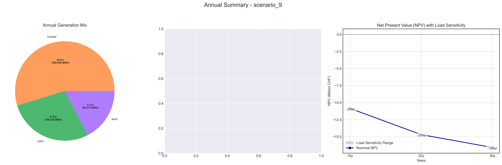
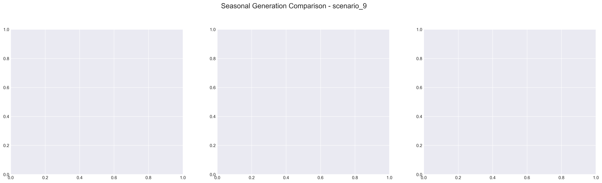

# Scenario Analysis Report: scenario_9
Generated on: 2025-01-29 17:37:48

## Overview

## Seasonal Generation Patterns

## Financial Analysis
| Metric | Value |
|--------|--------|
| Initial Investment | €22,290,920.00 |
| Annual Operating Cost | €2,765,877.81 |
| NPV (10 years) | €-54,337,633.93 |
| NPV (20 years) | €-69,894,765.55 |
| NPV (30 years) | €-77,998,641.78 |

## Generation Analysis

### Annual Generation by Asset Type
| Asset Type | Generation (MWh) |
|------------|-----------------|
| nuclear | 553,175.56 |
| solar | 128,315.64 |
| battery1 | nan |
| wind | 85,965.34 |
| gas | nan |
| battery2 | -31.44 |

### Generation Costs
| Asset Type | Cost (€) |
|------------|----------|
| cost_nuclear | 2,765,877.81 |
| cost_solar | 0.00 |
| cost_battery1 | nan |
| cost_wind | 0.00 |
| cost_gas | nan |
| cost_battery2 | 0.00 |

### Capacity Factors
| Asset Type | Capacity Factor |
|------------|----------------|
| nuclear | 7.92% |
| solar | 0.00% |
| battery1 | nan% |
| wind | 125.11% |
| gas | nan% |
| battery2 | -0.01% |

## AI Critical Analysis
# Critical Analysis of Scenario 9 (Nominal)

## Economic Efficiency
The annual cost of approximately $2.77 million seems disproportionately high for the generation output, particularly with nuclear power generating over half a million MW at an exorbitant cost. The cost per asset for solar, wind, and battery systems is reported as zero, indicating either an absence of operational output or a significant data anomaly that requires investigation.

## System Composition Strengths/Weaknesses
Strengths in this mix include the nuclear contribution, albeit at diminishing returns. Wind capacity factors appear absurdly elevated, suggesting potential over-performance or data inaccuracies, while the absence of productive solar generation flags an underutilized yet promising renewable resource. Battery contributions are unclear, and negative values point to potential issues in storage integration or misconfigured parameters.

## Recommendations for Improvement
Primary recommendations include a comprehensive review of solar and battery data to understand system performance better, alongside rectifying negative outputs. Exploring additional wind capacity while optimizing dispatch strategies could leverage renewables more effectively. Lastly, stakeholder engagement for a revised operational cost strategy that aligns with more efficient technologies may enhance affordability and sustainability.

---
