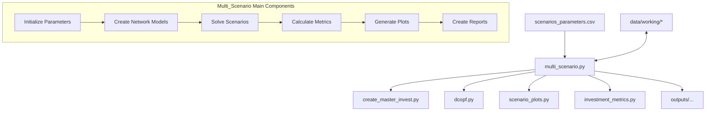

```mermaid
graph TD
    A[scenarios_parameters.csv] --> B[multi_scenario.py]
    B --> C[create_master_invest.py]
    B --> D[dcopf.py]
    B --> E[scenario_plots.py]
    B --> F[investment_metrics.py]
    G[data/working/*] <--> B
    B --> H[outputs/...]
    
    subgraph "Multi_Scenario Main Components"
        B1[Initialize Parameters]
        B2[Create Network Models]
        B3[Solve Scenarios]
        B4[Calculate Metrics]
        B5[Generate Plots]
        B6[Create Reports]
        B1 --> B2 --> B3 --> B4 --> B5 --> B6
    end
```