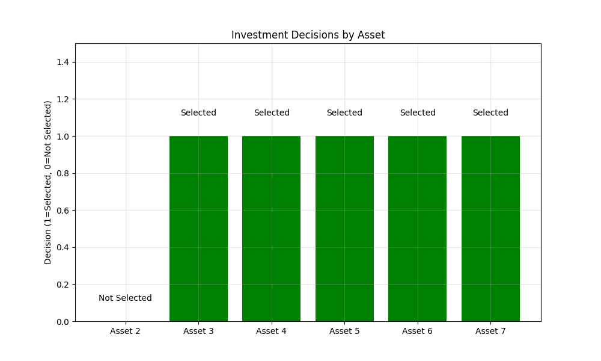
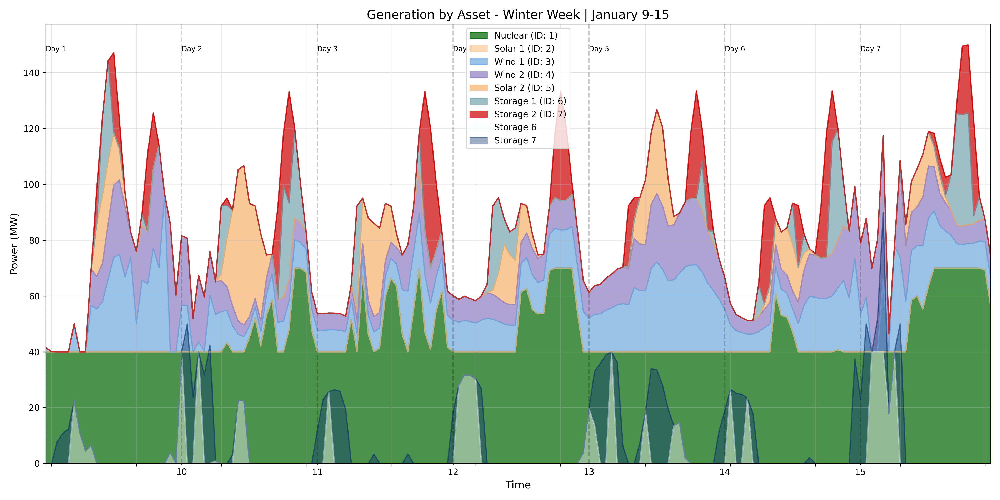
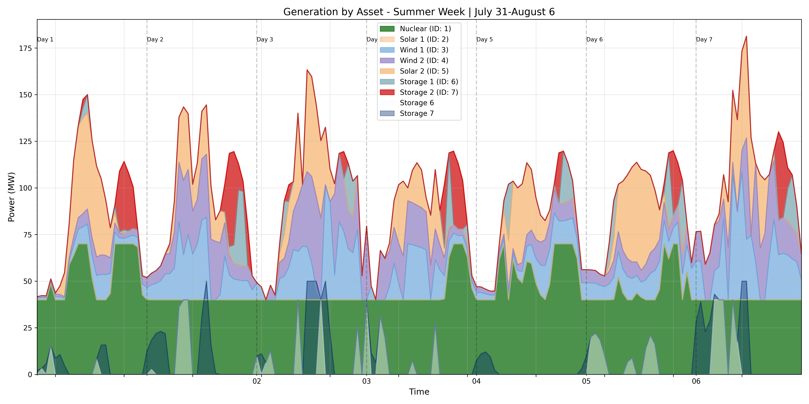
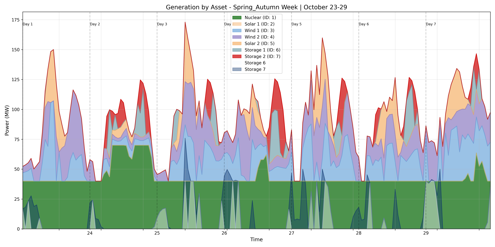

# Power System Analysis Results - TestPowerSystem

Generated on: 2025-03-27 22:57:13

## Network Summary

- Buses: 5
- Lines: 6
- Generators: 7
- Snapshots: 504

### Snapshot Weightings

- Weight 13.0: 336 snapshots
- Weight 26.0: 168 snapshots

## Cost Summary

- Total cost: $6,916,916.22
- Investment cost: $6,689,285.71
- Operational cost: $227,630.50

## Investment Decisions

| Asset ID | Decision | Annual Cost |
|----------|----------|-------------|
| 2 | Not selected | $0.00 |
| 3 | Selected | $171,428.57 |
| 4 | Selected | $150,000.00 |
| 5 | Selected | $160,000.00 |
| 6 | Selected | $87,500.00 |
| 7 | Selected | $100,000.00 |

## Annual Generation Summary

| Asset ID | Annual Generation (MWh) |
|----------|-------------------------|
| 1 | 390,744.54 |
| 3 | 135,683.45 |
| 4 | 137,701.38 |
| 5 | 75,705.43 |

## Annual Storage Charging

| Storage ID | Annual Charging (MWh) |
|------------|------------------------|
| 6 | 7,853.23 |
| 7 | 9,219.25 |

## Results Visualizations

### Investment Decisions

### Generation Profiles

